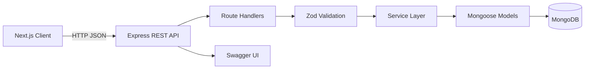

# HackIllinois Volunteer Management

Self-service volunteer shift signup for the HackIllinois 2027 Systems Coding Challenge. The Express API is the primary deliverable, with a Next.js client that demonstrates the volunteer workflow.

## Overview

Event organizers need a small, reliable way to publish shifts and track capacity without requiring every volunteer to create an account. This project lets volunteers browse open shifts, sign up with their name and email, and look up or remove their signups later.

The system is designed for:

- Hackathon and event organizers managing volunteer rosters
- Volunteers who need a low-friction signup experience
- Engineers evaluating a typed REST API, validation, persistence, and service-layer design

## Features

- Browse shifts with location, schedule, capacity, signup count, and remaining spots
- Self-service signup with name, normalized email, and optional phone number
- Find-or-create volunteer records by email
- Server-side duplicate-signup and capacity checks
- Unique database constraint preventing the same volunteer from signing up twice for one shift
- Volunteer and shift CRUD endpoints for administrative workflows
- Signup lookup by volunteer ID or email
- Signup removal
- Centralized error responses with `400`, `404`, `409`, and `500` handling
- Swagger UI at `/api/docs`
- Seed data for local development
- Automated backend API tests using Jest, Supertest, and an in-memory MongoDB server

## Tech Stack

| Layer             | Technology                             | Role                                                          |
| ----------------- | -------------------------------------- | ------------------------------------------------------------- |
| Frontend          | Next.js 14, React 18, TypeScript       | Demonstration client for browsing shifts and managing signups |
| Client data       | TanStack React Query                   | Fetching and caching API data                                 |
| Styling           | Tailwind CSS 4                         | Responsive UI styling                                         |
| Backend           | Node.js, Express 5, TypeScript         | REST API and HTTP middleware                                  |
| Validation        | Zod                                    | Runtime validation and normalization of request data          |
| Database          | MongoDB, Mongoose 8                    | Document persistence, references, and indexes                 |
| API documentation | Swagger UI                             | Interactive API documentation                                 |
| Testing           | Jest, Supertest, mongodb-memory-server | Route and application-level tests                             |
| Tooling           | ESLint, Prettier, `tsx`                | Static checks, formatting, and TypeScript execution           |
| Authentication    | None                                   | Intentionally omitted for the self-service MVP                |

## Database / Data Design (Visual Overview)

The API uses three MongoDB collections. `Signup` is a separate collection rather than an array embedded in `Shift`, which keeps shift documents small, supports direct relationship queries, and allows a unique compound index for duplicate prevention.

```text
┌──────────────────────────────────────┐
│ Volunteer                            │
├──────────────────────────────────────┤
│ PK _id: ObjectId                     │
│    name: string                      │
│    email: string, unique, lowercase  │
│    phone?: string                    │
│    createdAt, updatedAt              │
└──────────────────────────────────────┘
                 ↑ FK volunteerId
                 │
┌──────────────────────────────────────┐
│ Signup                               │
├──────────────────────────────────────┤
│ PK _id: ObjectId                     │
│ FK volunteerId: ObjectId             │
│ FK shiftId: ObjectId                 │
│    createdAt                         │
│                                      │
│ UNIQUE (volunteerId, shiftId)        │
└──────────────────────────────────────┘
                 │ FK shiftId
                 ↓
┌──────────────────────────────────────┐
│ Shift                                │
├──────────────────────────────────────┤
│ PK _id: ObjectId                     │
│    title: string                     │
│    description?: string              │
│    location?: string                 │
│    startTime: Date                   │
│    endTime: Date                     │
│    capacity: number                  │
│    createdAt, updatedAt              │
└──────────────────────────────────────┘
```

### Data flow

1. The frontend requests shifts from `GET /api/shifts`.
2. The API queries `Shift` and counts related `Signup` documents to derive `signupCount`, `remainingSpots`, and status.
3. A signup request validates input with Zod, finds or creates a `Volunteer` by normalized email, checks the shift and duplicate constraint, then creates a `Signup`.
4. The response returns the volunteer and updated shift summary for immediate client feedback.

Deleting a volunteer or shift also removes related signups. This is an explicit MVP policy rather than soft deletion.

## System Architecture / How It Works



The backend separates routing, validation, business logic, models, and error handling. TypeScript catches mistakes at compile time, while Zod validates untrusted request data at runtime. CORS allows the configured frontend origin to call the API.

### Self-service signup flow

```text
POST /api/shifts/:shiftId/signup
        ↓
Validate shift ID and { name, email, phone? }
        ↓
Load shift and check available capacity
        ↓
Find or create Volunteer by normalized email
        ↓
Create Signup subject to the unique compound index
        ↓
Return volunteer, shift, remaining spots, or a structured error
```

The readable MVP flow checks capacity before inserting the signup. Two concurrent requests can still observe the same remaining spot. The duplicate index is atomic for volunteer and shift pairs, but capacity reservation is not. A production version would use a transaction with an atomic counter or a conditional reservation update with retry handling.

## Installation & Setup

### Prerequisites

- Node.js 20 or newer
- MongoDB running locally or a MongoDB connection string

### Start the backend

```powershell
cd backend
npm install
New-Item -ItemType File -Path .env -Force
```

Add the following to `backend/.env`:

```dotenv
MONGODB_URI=mongodb://127.0.0.1:27017/hackillinois-volunteers
PORT=4000
FRONTEND_URL=http://localhost:3000
NODE_ENV=development
```

Then start the API:

```powershell
npm run dev
```

The API runs at `http://localhost:4000`. Swagger UI is available at `http://localhost:4000/api/docs`.

### Start the frontend

In a second terminal from the repository root:

```powershell
npm install
"NEXT_PUBLIC_API_URL=http://localhost:4000/api" | Set-Content .env.local
npm run dev
```

The Next.js client runs at `http://localhost:3000`. The API URL defaults to the same value, so `.env.local` is optional for the default local setup.

### Seed development data

With MongoDB configured:

```powershell
cd backend
npm run seed
```

The seed command clears and recreates volunteers, shifts, and signups. It is never run automatically by the server.

## Usage

Open `http://localhost:3000` to:

- View open and full shifts
- Open a shift and submit a signup
- Look up signups by email from **My Signups**
- Remove an existing signup

Useful API endpoints include:

```text
GET    /api/health
GET    /api/shifts
POST   /api/shifts
GET    /api/shifts/:shiftId
POST   /api/shifts/:shiftId/signup
DELETE /api/shifts/:shiftId/signup/:volunteerId
GET    /api/shifts/:shiftId/volunteers
GET    /api/volunteers
POST   /api/volunteers
GET    /api/volunteers/by-email/:email/shifts
GET    /api/docs
```

Run the backend test suite and production build with:

```powershell
cd backend
npm test
npm run build
```

## Key Learnings

- TypeScript and Zod solve different problems: static contracts help during development, while Zod protects runtime API boundaries.
- A separate signup collection makes the volunteer-to-shift relationship explicit and allows a database-level duplicate guarantee.
- Normalizing email before lookup gives the self-service flow a stable volunteer identity without requiring authentication.
- Derived capacity fields should be calculated from signup records rather than duplicated counters that can drift.
- A service-level capacity check is easy to read, but high-contention reservation logic requires an atomic database operation.
- Centralized error handling keeps route behavior predictable for both the frontend and API consumers.

## Future Improvements

- Add authentication and role-based authorization for organizer endpoints
- Make capacity reservation atomic with transactions or conditional updates
- Add email confirmation and cancellation notifications
- Add pagination metadata and richer shift filtering
- Add rate limiting and request tracing for public signup endpoints
- Expand integration tests around concurrent signups and deletion cascades
- Add production deployment configuration and observability
