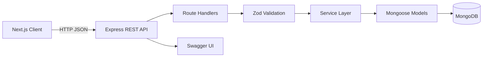

# HackIllinois Volunteer Management API

Self-service volunteer shift signup for the HackIllinois 2027 Systems Coding Challenge. The project combines a typed Express REST API with a Next.js client that demonstrates the volunteer workflow.

The API is the primary deliverable. The frontend provides a practical reference client for browsing shifts, submitting signups, and managing existing signups.

## Overview

Event organizers need a small, reliable way to publish shifts and track capacity without requiring every volunteer to create an account. This project lets volunteers browse open shifts, sign up with their name and email, and look up or remove their signups later.

The system is designed for:

- Hackathon and event organizers managing volunteer rosters
- Volunteers who need a low-friction signup experience
- Engineers evaluating a typed REST API, validation, persistence, and service-layer design

## Features

- Browse shifts with location, schedule, capacity, signup count, and remaining spots
- Self-service signup with name, normalized email, and optional phone number
- Find-or-create volunteer records by normalized email
- Server-side duplicate-signup and capacity checks
- Unique database constraint preventing the same volunteer from signing up twice for one shift
- Volunteer and shift CRUD endpoints for administrative workflows
- Signup lookup by volunteer ID or email
- Signup removal
- Centralized error responses with `400`, `404`, `409`, and `500` handling
- Swagger UI at `/api/docs`
- Seed data for local development
- Automated backend API tests using Jest, Supertest, and an in-memory MongoDB server

## Tech Stack

| Layer             | Technology                             | Role                                                          |
| ----------------- | -------------------------------------- | ------------------------------------------------------------- |
| Frontend          | Next.js 14, React 18, TypeScript       | Demonstration client for browsing shifts and managing signups |
| Client data       | TanStack React Query                   | Fetching and caching API data                                 |
| Styling           | Tailwind CSS 4                         | Responsive UI styling                                         |
| Backend           | Node.js, Express 5, TypeScript         | REST API and HTTP middleware                                  |
| Validation        | Zod                                    | Runtime validation and normalization of request data          |
| Database          | MongoDB, Mongoose 8                    | Document persistence, references, and indexes                 |
| API documentation | Swagger UI                             | Interactive API documentation                                 |
| Testing           | Jest, Supertest, mongodb-memory-server | Route and application-level tests                             |
| Tooling           | ESLint, Prettier, `tsx`                | Static checks, formatting, and TypeScript execution           |
| Authentication    | None                                   | Intentionally omitted for the self-service MVP                |

## Database / Data Design (Visual Overview)

The API uses three MongoDB collections. `Signup` is a separate collection rather than an array embedded in `Shift`, which keeps shift documents small, supports direct relationship queries, and allows a unique compound index for duplicate prevention.

```text
┌──────────────────────────────────────┐
│ Volunteer                            │
├──────────────────────────────────────┤
│ PK _id: ObjectId                     │
│    name: string                      │
│    email: string, unique, lowercase  │
│    phone?: string                    │
│    createdAt, updatedAt              │
└──────────────────────────────────────┘
                 ↑ FK volunteerId
                 │
┌──────────────────────────────────────┐
│ Signup                               │
├──────────────────────────────────────┤
│ PK _id: ObjectId                     │
│ FK volunteerId: ObjectId             │
│ FK shiftId: ObjectId                 │
│    createdAt                         │
│                                      │
│ UNIQUE (volunteerId, shiftId)        │
└──────────────────────────────────────┘
                 │ FK shiftId
                 ↓
┌──────────────────────────────────────┐
│ Shift                                │
├──────────────────────────────────────┤
│ PK _id: ObjectId                     │
│    title: string                     │
│    description?: string              │
│    location?: string                 │
│    startTime: Date                   │
│    endTime: Date                     │
│    capacity: number                  │
│    createdAt, updatedAt              │
└──────────────────────────────────────┘
```

```text
Volunteer (1) → Signup (many) ← (1) Shift
```

### Data flow

1. The frontend requests shifts from `GET /api/shifts`.
2. The API queries `Shift` and counts related `Signup` documents to derive `signupCount`, `remainingSpots`, and status.
3. A signup request validates input with Zod, starts a transaction, serializes access through the shift document, finds or creates a `Volunteer` by normalized email, checks the duplicate and capacity constraints, then creates a `Signup`.
4. The response returns the volunteer and updated shift summary for immediate client feedback.

Deleting a volunteer or shift also removes related signups. This is an explicit MVP policy rather than soft deletion.

## System Architecture / How It Works



The backend separates routing, validation, business logic, models, and error handling. TypeScript catches mistakes at compile time, while Zod validates untrusted request data at runtime. CORS allows the configured frontend origin to call the API.

### Self-service signup flow

```text
POST /api/shifts/:shiftId/signup
        ↓
Validate shift ID and { name, email, phone? }
        ↓
Start MongoDB transaction
        ↓
Serialize concurrent signups for the Shift
        ↓
Find or create Volunteer by normalized email
        ↓
Check duplicate signup and available capacity
        ↓
Create Signup subject to the unique compound index
        ↓
Commit transaction
        ↓
Return volunteer, shift, remaining spots, or a structured error
```

Signup creation uses a MongoDB transaction so concurrent requests cannot both claim the same final available spot. The transaction also prevents partially completed operations, such as leaving behind a newly created `Volunteer` when `Signup` creation fails. A temporary write to the `Shift` document acts as the serialization point; the configured `capacity` is unchanged after the transaction commits. This requires a MongoDB deployment that supports transactions, such as a replica set.

## Installation & Setup

### Prerequisites

- Node.js 20 or newer
- MongoDB running as a replica set locally, MongoDB Atlas, or another MongoDB deployment that supports transactions

### Start the backend

```powershell
cd backend
npm install
New-Item -ItemType File -Path .env -Force
```

Add the following to `backend/.env`:

```dotenv
MONGODB_URI=mongodb://127.0.0.1:27017/hackillinois-api?replicaSet=rs0
PORT=4000
FRONTEND_URL=http://localhost:3000
NODE_ENV=development
```

Then start the API:

```powershell
npm run dev
```

The API runs at `http://localhost:4000`. Swagger UI is available at `http://localhost:4000/api/docs`.

### Start the frontend

In a second terminal from the repository root:

```powershell
npm install
"NEXT_PUBLIC_API_URL=http://localhost:4000/api" | Set-Content .env.local
npm run dev
```

The Next.js client runs at `http://localhost:3000`. The API URL defaults to the same value, so `.env.local` is optional for the default local setup.

### Seed development data

With MongoDB configured:

```powershell
cd backend
npm run seed
```

The seed command clears and recreates volunteers, shifts, and signups. It is never run automatically by the server.

### Seed the deployed database

Netlify deploys the application code, but the seed records must be inserted into the MongoDB Atlas database separately. Run the existing seed command once from your local repository, using the same Atlas connection string configured in Netlify:

```powershell
cd backend
npm install
$env:MONGODB_URI="mongodb+srv://<user>:<password>@<cluster>/<database>?retryWrites=true&w=majority"
npm run seed
Remove-Item Env:MONGODB_URI
```

This command deletes and recreates all volunteers, shifts, and signups in that database. Do not add it to the Netlify build command or run it against a database containing data you need to keep. After it completes, redeploying the site is not necessary; the deployed API will read the seeded Atlas data through `MONGODB_URI`.

## Netlify Deployment

The repository deploys as one Netlify site. Next.js serves the frontend, and the rewrite in `netlify.toml` sends `/api/*` requests to `netlify/functions/api.ts`. That function connects to MongoDB and wraps the existing Express app from `backend/src/app.ts`; the backend routes are not duplicated.

Production MongoDB must support transactions because signup capacity and duplicate prevention use MongoDB transactions. MongoDB Atlas provides a suitable replica-set deployment.

Set these Netlify environment variables:

```dotenv
MONGODB_URI=mongodb+srv://<user>:<password>@<cluster>/<database>?retryWrites=true&w=majority
NEXT_PUBLIC_API_URL=/api
```

`MONGODB_URI` is server-only and must never use a `NEXT_PUBLIC_` name. `NEXT_PUBLIC_API_URL` is intentionally exposed to the browser and should be `/api` for the single-site production deployment. `FRONTEND_URL` is optional in production because the frontend and API share an origin; set it to `http://localhost:3000` for local frontend-to-backend CORS when using the standalone backend.

In Netlify, use the repository root as the base directory. The exact build settings are:

- Build command: `npm install --prefix backend && npm run build`
- Publish directory: `.next`
- Functions directory: `netlify/functions`
- Node bundler: `esbuild`

Deploy by connecting the repository to Netlify, adding the environment variables above, and deploying the main branch. The production API is available at `/api/*`, including `/api/health`, `/api/shifts`, and `/api/shifts/:shiftId/signup`.

For local development, run the backend with `cd backend; npm install; npm run dev` and the frontend from the repository root with `npm install; npm run dev`. Set `NEXT_PUBLIC_API_URL=http://localhost:4000/api` in `.env.local` when using the standalone backend. Set `MONGODB_URI` and `FRONTEND_URL=http://localhost:3000` in `backend/.env`. The local API remains at `http://localhost:4000`.

## Usage

Open `http://localhost:3000` to:

- View open and full shifts
- Open a shift and submit a signup
- Look up signups by email from **My Signups**
- Remove an existing signup

Useful API endpoints include:

```text
GET    /api/health
GET    /api/shifts
POST   /api/shifts
GET    /api/shifts/:shiftId
POST   /api/shifts/:shiftId/signup
DELETE /api/shifts/:shiftId/signup/:volunteerId
GET    /api/shifts/:shiftId/volunteers
GET    /api/volunteers
POST   /api/volunteers
GET    /api/volunteers/by-email/:email/shifts
GET    /api/docs
```

Run the backend test suite and production build with:

```powershell
cd backend
npm test
npm run build
```
